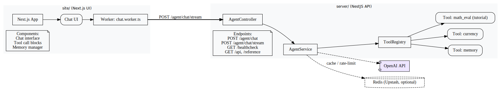
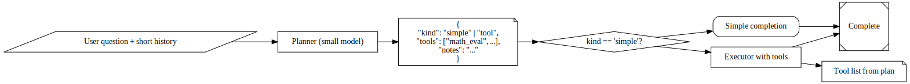
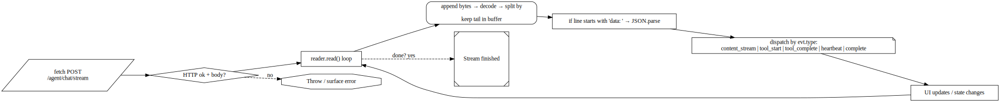
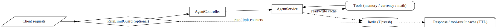

# SignalBox LLM — A Production‑Ready Railway Monorepo for Multi‑Agent LLM Apps

[](https://nodejs.org/)
[](https://www.typescriptlang.org/)
[](https://nestjs.com/)
[](https://nextjs.org/)
[](https://react.dev/)
[](https://tailwindcss.com/)
[](https://redis.io/)
[](https://www.docker.com/)
[](https://railway.app/)
[](https://platform.openai.com/)
[](./LICENSE)

[](https://vidova.ai/share/3fe5acc2-510e-4148-b10d-cf9d736fc36a)

 A real-world, opinionated monorepo you can deploy and scale on Railway. It prioritizes:
- Clear separation of concerns (API vs Web) with independent scaling.
- A pragmatic multi‑agent pattern (Planner → Executor) to control quality and cost.
- Streaming SSE, tool calling, response/tool caching (optional), and safe rendering.
- Predictable builds using either Nixpacks or Dockerfiles.

[MIT licensed.](./LICENSE)

## What you get



- `server` (NestJS)
  - Streaming endpoints: `POST /agent/chat`, `POST /agent/chat/stream`
  - Tools: memory, currency conversion, and a tutorial for a safe `math_eval` tool
  - Optional Redis (Upstash REST) for response + tool result caching and rate limits
  - Works without `OPENAI_API_KEY` (returns a clear setup message instead of crashing)
  - Multi‑agent pattern you can toggle: cheap Planner decides which expensive actions to take
- `site` (Next.js)
  - Minimal chat UI with streaming token display and tool call blocks
  - Safe markdown rendering (no raw HTML injection)

Monorepo layout:
```
root/
  server/  (NestJS API)
  site/    (Next.js UI)
```

No nested Git repos inside `server/` or `site/` (one repository at the root).


## Build & Run Locally

Requirements: Node 20+ (22 recommended)

### 1) API
Variables (set in your shell or `.env.local`):
- OPENAI_API_KEY (optional for boot, required for real responses)
- OPENAI_BASE_URL (optional, default `https://api.openai.com/v1`)
- OPENAI_MODEL (e.g., `gpt-4o`)
- OPENAI_TEMPERATURE (e.g., `0.1`)
- MAX_ITERATIONS (default `5`)
- Optional cache/rate-limit: UPSTASH_REDIS_REST_URL, UPSTASH_REDIS_REST_TOKEN

Commands:
```bash
cd server
npm install
npm run build
npm run start:prod
# Health:    http://localhost:3000/healthcheck
# Swagger:   http://localhost:3000/api
# Reference: http://localhost:3000/reference
```

Behavior without secrets:
- If `OPENAI_API_KEY` is missing: API responds with “Configure your API key…” rather than crashing.
- If Redis env is missing: caching/rate-limit are disabled automatically.

### 2) Web
Variable:
- NEXT_PUBLIC_BACKEND_URL (e.g., `http://localhost:3000`)

Commands:
```bash
cd site
npm install
npm run build
npm start
# Visit the printed URL and send a message
```


## Deploy on Railway (Monorepo)

Create two services from the same GitHub repo.

### API service (server)
[](https://railway.app/new)
- Root Directory: `server`
- Start Command: `npm run start:prod`
- Variables: set `OPENAI_API_KEY`; optionally `OPENAI_MODEL`, `OPENAI_TEMPERATURE`, cache vars
- Verify: `/healthcheck`, `/api`, `/reference`

### Web service (site)
[](https://railway.app/new)
- Root Directory: `site`
- Start Command: `next start`
- Variables: set `NEXT_PUBLIC_BACKEND_URL` to the API service URL

Notes:
- Deploy API first, copy its public URL, then configure Web and deploy.
- Scale API and Web independently in Railway for performance/cost control.


## Dockerfiles (when you need deterministic builds)

Railway uses Nixpacks by default, but if a Dockerfile exists, Railway will build with Docker.

### API Dockerfile (multi‑stage)
```dockerfile
# server/Dockerfile
FROM node:22-alpine AS deps
WORKDIR /app
COPY package*.json ./
RUN npm ci --omit=dev

FROM node:22-alpine AS build
WORKDIR /app
COPY --from=deps /app/node_modules ./node_modules
COPY . .
RUN npm run build

FROM node:22-alpine AS prod
WORKDIR /app
ENV NODE_ENV=production
ENV PORT=3000
COPY --from=build /app/dist ./dist
COPY --from=deps /app/node_modules ./node_modules
EXPOSE 3000
CMD ["node", "dist/main"]
```

### Web Dockerfile (Next.js)
```dockerfile
# site/Dockerfile
FROM node:22-alpine AS deps
WORKDIR /app
COPY package*.json ./
RUN npm ci

FROM node:22-alpine AS build
WORKDIR /app
COPY --from=deps /app/node_modules ./node_modules
COPY . .
RUN npm run build

FROM node:22-alpine AS prod
WORKDIR /app
ENV NODE_ENV=production
ENV PORT=3000
COPY --from=build /app/.next ./.next
COPY --from=build /app/public ./public
COPY package*.json ./
COPY --from=deps /app/node_modules ./node_modules
EXPOSE 3000
CMD ["npm", "start"]
```

Use Docker when you need precise runtime control (Node version pinning, OS packages, consistent cold start performance).

### SSE on Railway: a battle‑tested playbook for real LLM traffic



You’re building a streaming LLM app on Railway. Success means long‑lived HTTP connections, bursts of concurrent streams, and no “mystery” disconnects. This tutorial is an explicit, production‑minded guide that goes deep on SSE‑style streaming, costs, scaling, and multi‑agent orchestration, using this monorepo as the baseline.

---

## What breaks first (and how to prevent it)

- Long‑lived connections: every stream occupies a server worker while tokens drip. If you don’t budget for this, you’ll melt.
- Proxy buffering/idle: some proxies buffer output or kill idle streams. You must send regular, tiny heartbeats.
- Memory creep: every open stream holds response buffers and per‑request state. Cap stream duration and chunk size.
- Tool explosions: letting agents call infinite tools will set your wallet on fire. Put ceilings everywhere.

Principles:
- Always send keep‑alives during streams.
- Cap duration, tokens, and iterations.
- Make streaming idempotent where possible.
- Do not crash without secrets; degrade with clear guidance.

---

## Server-side streaming: two patterns that actually work



This template streams using a POST body and reads the body as a stream on the client. You can also offer a GET SSE endpoint with EventSource. Pick one (or both).

### A) POST + fetch streaming (current template)

- Why: Allows sending a JSON body (conversation, memories). Works well with browsers and Workers.
- Headers: the template sets up NestJS `@Sse()` but you can also respond with chunked `text/event-stream` manually if needed.

Skeleton (NestJS streaming loop):
```ts
// server/src/agent/agent.controller.ts (already wired to /agent/chat/stream)
@Post('chat/stream')
@Sse()
chatStream(@Body() dto: ChatRequestDto, @RealIP() userIp: string): Observable<MessageEvent> {
  // Inside AgentService.processRequestStream we:
  // - emit content_stream chunks
  // - optionally emit tool_start/tool_complete messages
  // - periodically emit heartbeats to keep proxies honest
}
```

Inside the loop, send heartbeats if you haven’t emitted content for a while:
```ts
// Pseudocode inside your streaming for-await loop
let lastFlush = Date.now()
const HEARTBEAT_MS = 15000

if (Date.now() - lastFlush > HEARTBEAT_MS) {
  yield { type: 'heartbeat', content: 'ping', timestamp: new Date().toISOString() } as any
  lastFlush = Date.now()
}
```

Also:
- Catch OpenAI/API errors and emit a final “complete” event with an error payload.
- Abort quickly if the client disconnects (in NestJS Observable, use finalize/teardown; in raw Express, listen to `req.on('close')`).

### B) GET + EventSource (classic SSE)

- Why: Fewer moving parts. No body. Browser API is dead simple.
- How: Provide a GET endpoint that sets `Content-Type: text/event-stream`, `Cache-Control: no-cache`, `Connection: keep-alive`, and never ends until done.

Express‑style example (if you add a raw route):
```ts
res.setHeader('Content-Type', 'text/event-stream')
res.setHeader('Cache-Control', 'no-cache, no-transform')
res.setHeader('Connection', 'keep-alive')
res.flushHeaders()

const send = (event: string, data: any) => {
  res.write(`event: ${event}\n`)
  res.write(`data: ${JSON.stringify(data)}\n\n`)
}

const HEARTBEAT_MS = 15000
const hb = setInterval(() => send('heartbeat', { t: Date.now() }), HEARTBEAT_MS)

req.on('close', () => { clearInterval(hb); /* cancel upstream */ })
```

Client:
```js
const es = new EventSource(`${api}/agent/events?session=abc`)
es.onmessage = (ev) => { /* tokens */ }
es.addEventListener('heartbeat', () => {/* no-op */})
```

Pick the pattern that matches your routing/UX. This template ships with POST streaming via fetch.

---

## Client receive loop that doesn’t flake

On the Web side, don’t assume the network is perfect. Parse lines carefully, and surface errors cleanly.

From this template’s worker (simplified):
```ts
const res = await fetch(`${API}/agent/chat/stream`, {
  method: 'POST',
  headers: { 'Content-Type': 'application/json' },
  body: JSON.stringify(requestBody),
})

if (!res.ok || !res.body) throw new Error(`HTTP ${res.status}`)

const reader = res.body.getReader()
const decoder = new TextDecoder()
let buf = ''

while (true) {
  const { value, done } = await reader.read()
  if (done) break
  buf += decoder.decode(value, { stream: true })
  const lines = buf.split('\n')
  buf = lines.pop() ?? ''
  for (const line of lines) {
    if (!line.trim()) continue
    // Expect "data: {json}" lines; parse and dispatch by 'type'
    if (line.startsWith('data: ')) {
      const evt = JSON.parse(line.slice(6))
      // content_stream | tool_start | tool_complete | heartbeat | complete
    }
  }
}
```

Non‑negotiables:
- Never block the reader loop.
- Log stream length regularly; it’s your only quick signal of progress.
- Show backpressure in the UI (token dots) to keep users calm.

---

## Multi‑agent that doesn’t bankrupt you: Planner → Executor

The cheapest way to cut costs is to avoid expensive calls. Use a tiny “Planner” pass first, then decide if a tool‑enabled stream is even necessary.

Flow:
1) Planner (small model, low tokens) → plan JSON:
   - `{ kind: "simple" }` → do a short completion, no tools
   - `{ kind: "tool", tools: ["math_eval"] }` → run Executor
2) Executor (normal flow with tools + SSE streaming)
3) Always cap `MAX_ITERATIONS`, `MAX_*_TOKENS`

Planner prompt sketch:
```text
You are the planner. Given a user message and short history, return a JSON plan:
- If the question can be answered directly, return { "kind": "simple" }.
- If it requires tools, return { "kind": "tool", "tools": ["math_eval", ...], "notes": "..." }.
Only return JSON.
```

Executor respects the plan. Many queries will be “simple” → you just saved money and latency.

---

## Railway scaling: streams, instances, and practical math



SSE concurrency math:
- Let average stream time be \( T \) seconds.
- Let peak requests per second be \( R \).
- Concurrent streams \( C \approx R \times T \).

If a single API instance comfortably handles \( C_i \) concurrent streams (test this!), you need \( \lceil C / C_i \rceil \) instances.

How to raise \( C_i \):
- Keep streams short: Planner first; lower token caps.
- Send heartbeats every ~10–20s; avoid premature proxy cuts.
- Avoid heavy work in the same loop as streaming; offload CPU‑heavy parts to tools or background jobs.
- Use a memory budget: avoid storing full transcripts per request; write only what you must.

Horizontal scale:
- API and Web are separate services; scale API horizontally under bursts.
- Keep the API stateless. Caching and rate‑limit can use Redis (optional). The template intentionally runs fine without Redis to ease first deploy.

Guardrails that save you real money:
- `MAX_ITERATIONS` default 5
- Low `OPENAI_TEMPERATURE` when you’re tool calling (you want determinism)
- `OPENAI_MAX_TOKENS` caps
- Tool result caching with short TTL (e.g., currency, math)
- Rate‑limit if you open the app to the public

---

## Docker vs Nixpacks on Railway

Default (Nixpacks) is fine. Use Docker if you need:
- Exact Node version pinning, OS packages
- Predictable cold starts via optimized multi‑stage build

See Dockerfiles earlier in this README.

---

## Production debugging checklists

- Stream stalls:
  - Are heartbeats going out? Add logs on each heartbeat and final “complete”.
  - Browser shows “network error”? Check CORS and that you aren’t buffering in a reverse proxy.
- Random “no output”:
  - Is `OPENAI_API_KEY` set? Template returns a clear message if missing.
  - Token limits too low? Loosen caps incrementally; watch your bill.
- Memory climbs:
  - Cap stream time; break giant replies into sections.
  - Trim conversation history; only send what’s needed.

---

## Cost levers (ranked by impact)

1) Prevent unnecessary tool mode via Planner.
2) Lower `MAX_*_TOKENS`, `MAX_ITERATIONS`.
3) Cache tool results with TTLs.
4) Rate‑limit public traffic.
5) Prefer smaller models when quality is acceptable.

If you do only (1) and (2), you’ll slash spend for most workloads.
